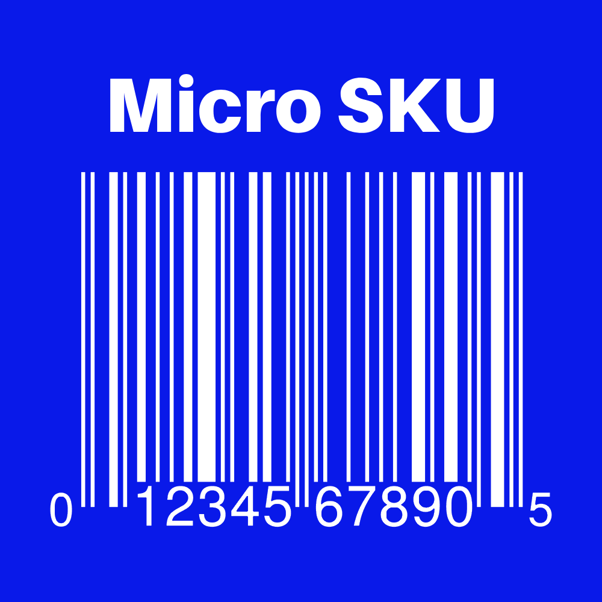
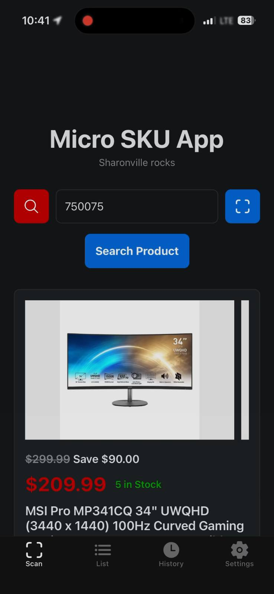

# Micro SKU App
#### Toolbelt for employees to scan items, create lists, view service plans and plan sheets, build PCs, and more!

# Installation

## iOS
### Please join the TestFlight to install the app!

## Android
### Android is in the process for being uploaded to the Play Store. Please sit tight, or download the .apk below!

## Sideloading

## Android
1. Visit the [Releases](https://github.com/gnhen/Micro-SKU-App/releases/latest) tab.
2. Download the Android apk
3. Install app

## iOS
1. Visit the [Releases](https://github.com/gnhen/Micro-SKU-App/releases/latest) tab.
2. Download the iOS ipa
3. Use a service to sideload, such as *Sideloadly* or ***SideStore***. SideStore is recommended.
4. Refresh app every 7 days or sooner (Or use a shortcut with SideStore)

### iOS Shortcut Version
#### For people that cannot or will not sideload, I have made an iOS shortcut version. This just takes you to the product page for each scanned item.
1. Visit the [Shortcut URL](https://www.icloud.com/shortcuts/6d2ae6b723774c589fb1c6dc8657500d)
2. Install
3. Add to Home Screen
   
   i. Tap 3 dots on top right of Shortcut
   
   ii. Tap Name of Shortcut
   
   iii. Tap "Add to Home Screen"

# Click the image to watch the demo

