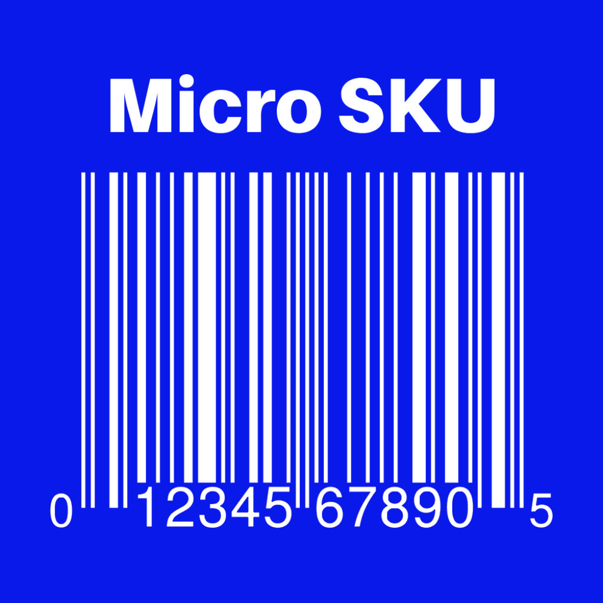
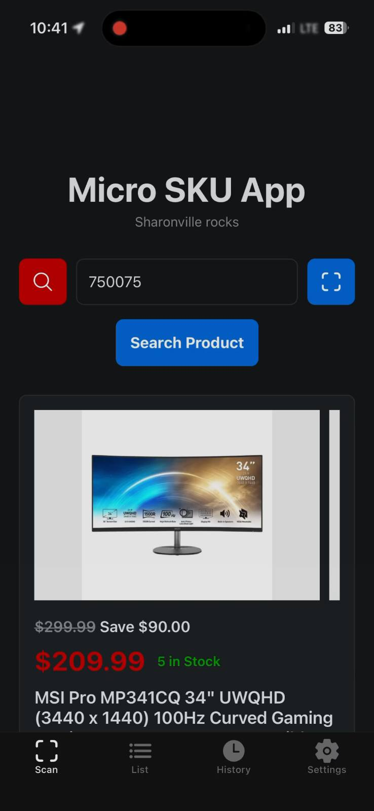

# Micro SKU App
#### Toolbelt for employees to scan items, create lists, view service plans and plan sheets, build PCs, and more!

# Installation

## iOS

### TestFlight

### Sideloading
1. Visit the [Releases](https://github.com/gnhen/Micro-SKU-App/releases/latest) tab.
2. Download the iOS `.ipa`.
3. Use a service to sideload, such as *Sideloadly* or ***SideStore***. SideStore is recommended.
4. Refresh the app every 7 days or sooner (or use a shortcut with SideStore).

### iOS Shortcut
For people that cannot or will not sideload, there is an iOS shortcut version that takes you to the product page for each scanned item.

1. Visit the [Shortcut URL](https://www.icloud.com/shortcuts/6d2ae6b723774c589fb1c6dc8657500d)
2. Tap **Share** → **Add to Home Screen**

## Android

### Sideloading
1. Visit the [Releases](https://github.com/gnhen/Micro-SKU-App/releases/latest) tab.
2. Download the Android `.apk`.
3. Install the app.

# Click the image to watch the demo

